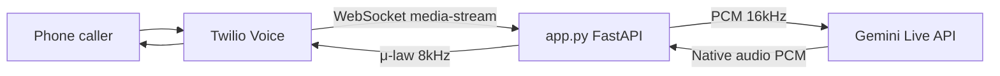

# Gloify AI Phone Assistant (Gemini Live + Twilio)

A **real-time voice AI phone assistant** for **Gloify**. Callers speak on the phone; the system listens, thinks with **Google Gemini Live API**, and responds with a **natural AI voice** streamed back through **Twilio**.

The production setup now uses **Gemini’s built-in voice** (`Kore`) because it is highly reliable, high-fidelity, and optimized for low-latency live phone calls.

---

## What This Project Does

| Feature | Description |
|--------|-------------|
| **Outbound from your phone** | When you place an outbound call from your personal phone to your Twilio number, you are connected to the AI assistant that answers questions about Gloify. |
| **Live conversation** | Bidirectional audio: caller → Twilio → your server → Gemini → your server → Twilio → caller. |
| **Company knowledge** | The assistant is prompted with Gloify services, industries, locations, and tone rules. |
| **Contact management** | Users (name + phone) and communication logs stored in JSON files under `data/`. |

---

## Architecture



### Call flow (Inbound to Twilio / Outbound from your phone)

1. You dial your **Twilio phone number** from your mobile phone (an outbound call from your phone's perspective).
2. Twilio hits **`POST /voice`** → returns TwiML that opens a **Media Stream** to `wss://YOUR_DOMAIN/media-stream`.
3. Your server accepts the WebSocket and connects to **Gemini Live** (`gemini-3.1-flash-live-preview` by default).
4. **Caller audio** (μ-law 8 kHz from Twilio) is converted to **PCM 16 kHz** and sent to Gemini.
5. **Gemini audio** (PCM) is converted to **μ-law 8 kHz** and sent back to Twilio for playback.
6. Transcriptions are logged in the terminal (caller input + assistant output).

---

## Voice / TTS Options

The application exclusively uses **Gemini Live native audio** to guarantee minimal latency and exceptional performance during phone calls.

### Gemini Live Native Audio

- Voice is set with **`GEMINI_VOICE`** (default: `Kore`).
- Other Gemini voices: `Puck`, `Aoede`, `Charon`, `Fenrir`, `Leda`, `Orus`, `Zephyr`.
- Works with models like `gemini-3.1-flash-live-preview`, which support **`AUDIO`** response modality.

---

## Problems We Fixed During Development

Understanding these helps if you debug similar issues later.

| Issue | Cause | Fix |
|-------|--------|-----|
| `response modalities (TEXT) is not supported` | `gemini-3.1-flash-live-preview` is a **native audio** model; it cannot reply with TEXT-only. | Use `response_modalities: ["AUDIO"]` and `output_audio_transcription` for logs. |

---

## Project Structure

```
CallingAgent/
├── app.py           # Main FastAPI app (API + Twilio + Gemini + voice pipeline)
├── requirements.txt # Python package dependencies
├── .env             # Secrets and configuration (not committed to git)
├── data/
│   ├── users.json   # Saved contacts
│   └── logs.json   # Call/SMS history
├── README.md        # This file
└── venv/            # Python virtual environment (optional)
```

---

## Requirements

- Python **3.10+**
- Accounts & keys:
  - [Twilio](https://www.twilio.com/) (phone number + Voice)
  - [Google AI Studio](https://aistudio.google.com/) (Gemini API key)
  - [ngrok](https://ngrok.com/) or similar **HTTPS** tunnel for local dev (Twilio needs a public URL)

### Python packages

Install requirements via `requirements.txt`:

```bash
pip install -r requirements.txt
```

Or activate your existing venv and run the install command.

---

## Configuration (`.env`)

Copy the example below into `.env` and fill in your values.

```env
# Twilio
TWILIO_ACCOUNT_SID=your_account_sid
TWILIO_AUTH_TOKEN=your_auth_token
TWILIO_PHONE_NUMBER=+1XXXXXXXXXX

# Public URL (ngrok) — no trailing slash on path; used for Media Stream WebSocket
BASE_URL=https://your-subdomain.ngrok-free.app

# Gemini
GEMINI_API_KEY=your_gemini_api_key
GEMINI_LIVE_MODEL=gemini-3.1-flash-live-preview

# Voice Configuration
GEMINI_VOICE=Kore

# Server
PORT=8000
HOST=0.0.0.0
```

### Twilio console setup

1. Buy or use a **Voice-capable** phone number.
2. Under the number’s **Voice configuration** → **A call comes in**:
   - Webhook: `https://YOUR_NGROK_HOST/voice`
   - Method: `POST`

---

## How to Run

```bash
cd CallingAgent
python3 -m venv venv          # if you don't have venv yet
source venv/bin/activate      # Linux/macOS
pip install -r requirements.txt

# Terminal 1 — tunnel
ngrok http 8000

# Terminal 2 — app (set BASE_URL in .env to your ngrok HTTPS URL)
python3 app.py
```

Open `http://localhost:8000/docs` for the interactive API.

### Test the call (Outbound from your phone to Twilio)

1. Make an outbound call to your Twilio number from your personal phone.
2. You should hear: *“Please wait while I connect you.”*
3. Then the **Gloify assistant** greets you and answers questions.

### Expected terminal output (success)

```text
📲 /voice hit — connecting media stream to wss://...
📞 Incoming Twilio Media Stream Connected
▶️  Stream Started | SID: MZ... | Call: CA...
✅ Connected to Gemini Live | voice=Kore
🤖 Gemini: Hi, I am the Gloify assistant...
🗣️  Caller: ...
```

---

## API Endpoints

| Method | Path | Description |
|--------|------|-------------|
| `GET` | `/` | Health / welcome message |
| `GET` | `/docs` | Swagger UI |
| `GET` / `POST` | `/voice` | Twilio voice webhook (TwiML + Media Stream) |
| `WebSocket` | `/media-stream` | Bidirectional audio with Twilio |
| `GET` | `/api/users` | List contacts |
| `POST` | `/api/users` | Create contact (`username`, `phone_number`) |
| `PUT` | `/api/users/{id}` | Update contact |
| `DELETE` | `/api/users/{id}` | Delete contact |
| `POST` | `/api/process-command` | Natural-language command (call/SMS user) |
| `GET` | `/api/logs` | Communication history |

### Example: register a user and place a call

```bash
# Create user
curl -X POST http://localhost:8000/api/users \
  -H "Content-Type: application/json" \
  -d '{"username": "Alice", "phone_number": "+14155552671"}'

# Command orchestrator (outbound call with message)
curl -X POST http://localhost:8000/api/process-command \
  -H "Content-Type: application/json" \
  -d '{"command": "Call Alice and tell her the meeting is at 3pm"}'
```

---

## AI Assistant Behavior

The system prompt defines the assistant as **Gloify’s official AI helper**:

- Explains services (software, mobile, AI, DevOps, marketing, etc.).
- Professional, concise, business-focused tone.
- Does not claim to be ChatGPT.
- Directs pricing questions to the sales team.
- Points to [https://gloify.com](https://gloify.com) for contact.

You can edit `COMPANY_CONTEXT` and `SYSTEM_PROMPT` in `app.py` to change behavior.

---

## Audio Technical Details

| Direction | Format |
|-----------|--------|
| Twilio ↔ your server | Base64 **μ-law (G.711)**, 8 kHz, mono |
| Your server → Gemini | **PCM 16-bit**, 16 kHz, mono |
| Gemini → your server | **PCM** (16 kHz or 24 kHz; detected from MIME type) |
| Playback to Twilio | Resampled to 8 kHz μ-law |

---

## Troubleshooting

| Symptom | What to check |
|---------|----------------|
| Call connects but no AI voice | Restart `app.py`; confirm `GEMINI_API_KEY` is valid; check console logs. |
| `Gemini send error` / TEXT modality | Old code or wrong model config; ensure `response_modalities` is `["AUDIO"]` only. |
| Twilio never reaches server | `BASE_URL` must match ngrok HTTPS host; Twilio webhook must point to `/voice`. |
| WebSocket fails | Firewall/ngrok; URL must be `wss://` (HTTPS tunnel). |
| Robotic or wrong speed audio | Sample-rate mismatch; check logs for `Gemini audio playback error`. |

---

## Security Notes

- **Never commit `.env`** to git (API keys, Twilio tokens).
- Rotate keys if they were exposed in logs or chat.
- Use Twilio request validation in production for webhooks.
- Restrict ngrok or deploy to a proper host (Railway, Fly.io, GCP, etc.) for production.

---

## Summary

You built a **production-style voice AI hotline** for Gloify:

1. **Twilio** handles telephony and real-time audio streaming.
2. **FastAPI** bridges Twilio and Gemini over WebSockets.
3. **Gemini Live** (`gemini-3.1-flash-live-preview`) powers understanding and speech with the **Kore** voice.
4. **REST APIs** manage users, logs, and outbound call/SMS commands.

Current configuration in `.env`:

```env
GEMINI_VOICE=Kore
```

---

## License & Contact

Internal Gloify project. For product questions: [https://gloify.com](https://gloify.com).
